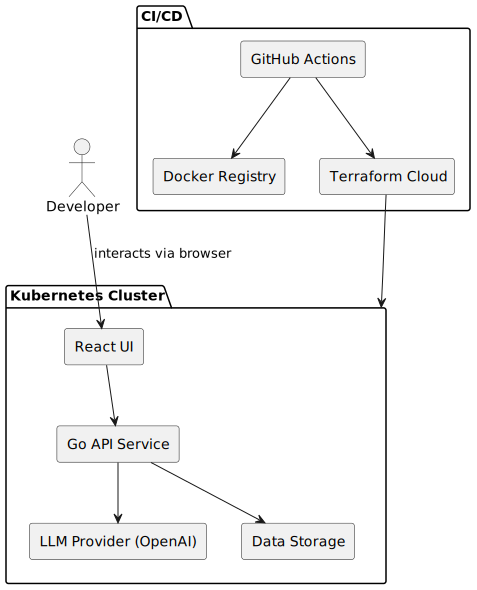

# Instructor VTA

[](https://github.com/OWNER/REPO/releases/latest)

## Background

As LLMs become central to automation and productivity workflows, developers often need structured, repeatable ways to construct prompts with dynamic parameters. This project aims to provide a frontend interface for visually constructing prompts by filling in template parameters, and a backend service to handle those templates, parameters, and LLM execution.

The interface is designed with modern developer tools in mind, using a React-based frontend styled with Tailwind and ShadCN UI. A minimal HTTP backend will be developed in Go, exposing OpenAPI-compatible endpoints to process requests and manage templates. Infrastructure provisioning will be automated via Terraform, enabling consistent deployment.

This solution is tailored to users with frontend-heavy experience but expanding into Go for backend services. It will connect to OpenAI's o3 Reasoning model to serve as a personal software development assistant. While persistent template storage is a potential enhancement, the MVP will not include long-term data persistence.

## Infrastructure

The application will be deployed to a managed Kubernetes service and orchestrated using Terraform. The architecture will rely on a pod-per-deployment structure, each environment (dev, staging, prod) running its own multi-container pod setup consisting of:

- **Frontend**: A React application served over an HTTP container.
- **HTTP Service**: Go-based backend exposing a hybrid GraphQL and REST API with optional WebSocket support to handle templates, parameter submission, and prompt forwarding to OpenAI's o3 model. GraphQL allows precise data fetching, while REST handles compatibility for system-level operations.
- **Data Storage**: An optional persistent volume and Postgres database, containerised to run alongside the service when persistence is required.

Infrastructure provisioning includes:

- VPC networking and ingress setup
- TLS certificate management (e.g., via Cert-Manager)
- GitOps/CD integration for build and deployment automation
- Environment-specific config via ConfigMaps/Secrets

Kubernetes resources and infrastructure lifecycle will be managed with Terraform, supporting multi-environment management and secure, scalable rollouts.

## Method

### Prompt Template Schema (MVP)

A prompt template will follow a JSON structure with placeholder variables marked using double curly braces (e.g., `{{variable_name}}`). This format supports dynamic UI generation and runtime substitution.

```json
{
  "name": "code_assistant",
  "description": "Suggests improvements to submitted code snippets",
  "template": "Here is the code: {{code_snippet}}. Suggest improvements.",
  "variables": [
    {
      "name": "code_snippet",
      "type": "string",
      "required": true,
      "description": "A block of source code to analyze"
    }
  ]
}
```

Each template will be submitted via a GraphQL mutation and used to dynamically generate parameter inputs on the frontend.

### System Architecture



This diagram shows runtime and CI/CD flow:

- Developers commit to GitHub
- GitHub Actions build Docker images and push to a registry
- Terraform plans and applies infra changes
- Updated containers are deployed into Kubernetes
- Data flows from UI → Go API → OpenAI, with optional writes to a data store.

## Implementation

### Frontend

- Set up project with Vite, TypeScript, Tailwind, and ShadCN UI
- Create component to input template variables dynamically
- Connect to GraphQL API for submitting prompts and templates

### Backend

- Bootstrap Go project with GraphQL and REST routers (e.g., gqlgen + chi)
- Define OpenAPI spec and GraphQL schema for:

  - Submitting templates
  - Fetching templates
  - Submitting prompt inputs

- Add optional WebSocket endpoint for streaming responses
- Implement OpenAI API integration

### Infrastructure

- Write Terraform scripts for:

  - Kubernetes cluster setup
  - Namespace and resource quotas per environment
  - TLS via Cert-Manager
  - Postgres PVC [setup](https://www.section.io/docs/tutorials/data/postgres-on-pvc/](https://www.section.io/docs/tutorials/data/postgres-on-pvc/)

- Define Kubernetes manifests:

  - Deployment with 3 containers: frontend, backend, data-store
  - ConfigMaps and Secrets for API keys and ENV variables

### CI/CD

- Configure GitHub Actions for:

  - Frontend + backend Docker image builds
  - Push to Docker Registry (ECR)
  - Run Terraform apply in specific branches (dev/staging/prod)

### Testing & QA

- Unit tests for backend business logic (template validation, OpenAI call)
- Cypress tests for the frontend prompt submission flow

### Deployment

- Deploy to development cluster
- Validate LLM integration, prompt templating, and frontend usability
- Plan staging and prod rollouts via Terraform workspace targeting

## Milestones

| Week       | Goal                                                                                                                                         |
| ---------- | -------------------------------------------------------------------------------------------------------------------------------------------- |
| **Week 1** | Project Bootstrap: initialize frontend + backend projects, define GraphQL and REST schema, set up GitHub Actions workflows                   |
| **Week 2** | Local MVP: implement basic UI and prompt template logic, connect Go backend to OpenAI o3 API, mock template submission + parameter fill flow |
| **Week 3** | Infrastructure Provisioning: deploy Kubernetes cluster with Terraform, configure networking, TLS, and container deployments                  |
| **Week 4** | CI/CD Pipeline: push images to container registry, automate dev/staging deployments via Terraform workflows                                  |
| **Week 5** | E2E Testing: add Cypress coverage for frontend workflows, add backend validation and API tests                                               |
| **Week 6** | Pre-Production Validation: complete feature and stability testing, finalize Terraform rollout config for production                          |
| **Week 7** | Launch & Feedback: deploy to production, collect initial usage feedback, identify follow-up features (e.g., persistence, auth)               |

## Gathering Results

After launch, success will be evaluated through both functional validation and user-centered metrics:

- ✅ **Prompt rendering accuracy:** Compare UI-generated prompt payloads with expected backend structure
- ✅ **LLM response quality:** Log and manually evaluate a sample of responses for coherence and correctness
- ✅ **UI usability:** Collect qualitative feedback from testers/developers on form clarity and usefulness
- ✅ **Backend reliability:** Monitor API uptime, response time, and error logs in production
- ✅ **Adoption metrics:** Track number of template submissions, distinct users, and average usage duration

Post-analysis, adjustments will be prioritized based on:

- Reported friction in prompt building or integration
- Common template structures suggesting pattern improvements
- Performance bottlenecks or scaling needs
